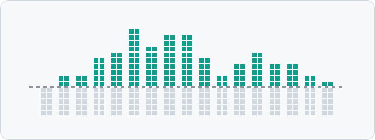
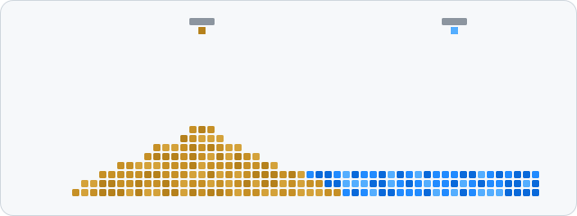
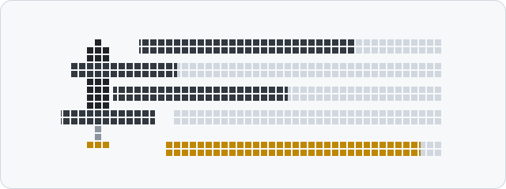

<picture>
  <source media="(prefers-color-scheme: dark)" srcset="assets/hero-dark.svg">
  <source media="(prefers-color-scheme: light)" srcset="assets/hero-light.svg">
  
</picture>

## Projects

<table>
  <tr>
    <td width="50%" valign="top">
      <a href="https://github.com/FueledByRedBull/audio-forge"><picture>
        <source media="(prefers-color-scheme: dark)" srcset="assets/audio-forge-dark.svg">
        <source media="(prefers-color-scheme: light)" srcset="assets/audio-forge-light.svg">
        
      </picture></a>
       
      <b><a href="https://github.com/FueledByRedBull/audio-forge">audio-forge</a></b>
       
      Windows microphone processor. Noise suppression, EQ and dynamics for calls, streams and recordings, all processed locally.
       
      <code>Rust</code> <code>Python</code> <code>PyQt6</code>
    </td>
    <td width="50%" valign="top">
      <a href="https://github.com/FueledByRedBull/Powder-Game"><picture>
        <source media="(prefers-color-scheme: dark)" srcset="assets/powder-game-dark.svg">
        <source media="(prefers-color-scheme: light)" srcset="assets/powder-game-light.svg">
        
      </picture></a>
       
      <b><a href="https://github.com/FueledByRedBull/Powder-Game">Powder-Game</a></b>
       
      GPU-first powder sandbox. Sand, water, smoke, fire and heat on a 1000 × 1000 grid, simulated in compute shaders.
       
      <code>C++20</code> <code>OpenGL 4.3</code> <code>GLSL</code>
    </td>
  </tr>
</table>
<table>
  <tr>
    <td width="50%" valign="top">
      <a href="https://github.com/FueledByRedBull/Twitch-Miner-Rust"><picture>
        <source media="(prefers-color-scheme: dark)" srcset="assets/twitch-miner-dark.svg">
        <source media="(prefers-color-scheme: light)" srcset="assets/twitch-miner-light.svg">
        
      </picture></a>
       
      <b><a href="https://github.com/FueledByRedBull/Twitch-Miner-Rust">Twitch-Miner-Rust</a></b>
       
      Unofficial Twitch channel points miner. Bonus chests, drops, watch streaks and predictions, shipped as a multi-arch scratch container.
       
      <code>Rust</code> <code>Tokio</code> <code>Docker</code>
    </td>
    <td width="50%" valign="top">
      <a href="https://github.com/FueledByRedBull/tarnisheds-arsenal"><picture>
        <source media="(prefers-color-scheme: dark)" srcset="assets/tarnisheds-arsenal-dark.svg">
        <source media="(prefers-color-scheme: light)" srcset="assets/tarnisheds-arsenal-light.svg">
        
      </picture></a>
       
      <b><a href="https://github.com/FueledByRedBull/tarnisheds-arsenal">tarnisheds-arsenal</a></b>
       
      Desktop build optimizer for Elden Ring. Search weapons, compare options and plan your next levels.
       
      <code>Rust</code> <code>Tauri</code> <code>React</code>
    </td>
  </tr>
</table>

Also on here:

- [thmmy-planner](https://github.com/FueledByRedBull/thmmy-planner): week planner for the ECE department at the University of Thessaly. [Open it](https://fueledbyredbull.github.io/thmmy-planner/).
- [ASCII](https://github.com/FueledByRedBull/ASCII): deterministic C++20 renderer that turns video and images into ANSI/ASCII.
- [maybe-wordle](https://github.com/FueledByRedBull/maybe-wordle): Wordle solver in Rust.
- [rust-spreadsheet](https://github.com/FueledByRedBull/rust-spreadsheet): spreadsheet with a Rust computation engine behind a PyQt6 UI.
- [crossword](https://github.com/FueledByRedBull/crossword): themed crosswords generated from a Wikipedia article.
- [CompVis](https://github.com/FueledByRedBull/CompVis): real-time facial expression analyzer.

The header and tiles are SVG animated with CSS keyframes. No JavaScript, no third-party widgets. <code>python build.py</code> regenerates them.
